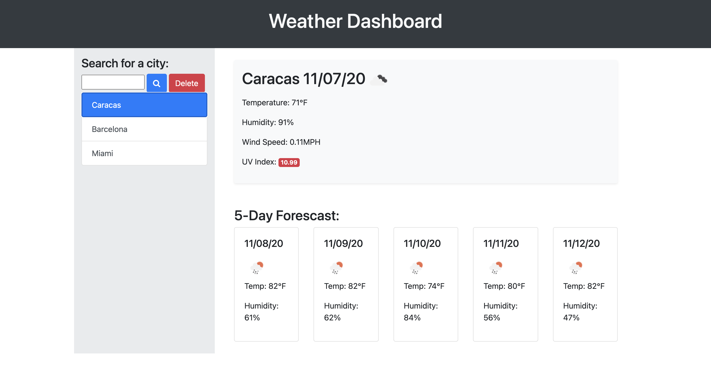

# Weather Dashboard

## Objective
To create a weather App that allows users to enter the name of the city they want to know the weather of, and returns the current weather and the weather forecast for the next five days.

## Development

To retrive the information for this app we used the OpenWeather API. To get all the information that we needed to display, we made two API calls: one for the current weather and one for the UV index + 5 next days. We also used JQuery, Bootstrap, and Moment.js, for the development of this app.

The app saves in local storage the latest cities that were searched, and displays them every time the user opens the app. As an additional feature, a delete button was added which removes the latest city from the DOM and local storage.

## Installation 
To be able to use this app, users must create a config.js file in the root directory, with the following code in it:

const config = {
  apiKey: 'your API key from the Open Weather API'
]

## Limitations
The user can enter any text in the input element. This will create a button regardless if it is a city or not. For future impovements, authentication for the city is desired.

Deployed URL: https://lmrujana.github.io/weather_dashboard/
